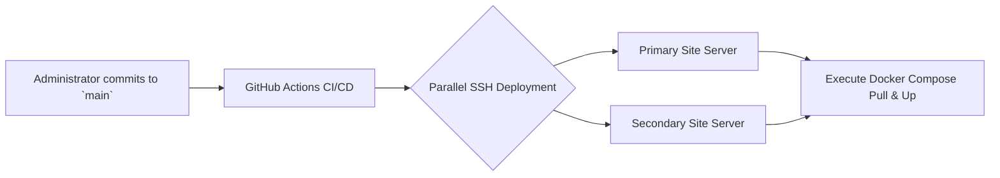
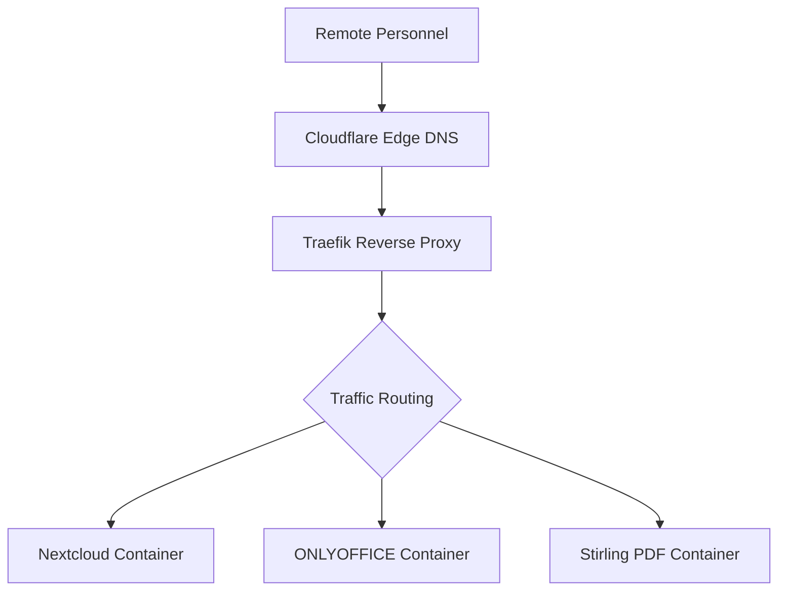

# Company Private Cloud Infrastructure

[](https://ubuntu.com/)


**A highly available, self-hosted enterprise private cloud infrastructure designed for secure file synchronization, collaborative document editing, and centralized internal tooling.**

> **Target Audience**
> This infrastructure is engineered for company personnel requiring secure, real-time collaboration platforms, and systems administrators overseeing multi-site deployments with stringent security and uptime requirements.

> **Business Value**
> Replaces fragmented, high-cost public SaaS subscriptions with a unified, self-hosted private cloud. It ensures complete data sovereignty, offers enterprise-grade capabilities, and drastically reduces operational expenditures across multiple organizational locations.

> **Technical Highlights**
> - Redundant, high-availability architecture across distributed edge locations
> - Zero-trust network access (ZTNA) and secure administration via Tailscale VPN
> - Infrastructure-as-Code (IaC) provisioning via Ansible
> - Fully automated CI/CD deployment pipelines via GitHub Actions
> - Automated SSL certificate lifecycle management and reverse proxying with Traefik v3
> - Self-hosted file storage (Nextcloud) integrated with real-time document editing (ONLYOFFICE)

---

## Pre-requisites & Account Setup

Prior to deployment, ensure organizational accounts and API credentials are provisioned for the following services:

| Service | Purpose | Platform |
|---------|---------|------|
| **Cloudflare** | DNS Management & DDoS Mitigation | [cloudflare.com](https://www.cloudflare.com/) |
| **Tailscale** | Secure Overlay Network / Admin Access | [tailscale.com](https://tailscale.com/) |
| **GitHub** | CI/CD Actions & Secrets Management | [github.com](https://github.com/) |
| **Backblaze B2** | Immutable Offsite Backups | [backblaze.com](https://www.backblaze.com/) |

---

## Infrastructure Overview

This Company Private Cloud serves as an integrated, self-hosted ecosystem. It provides personnel with secure data storage and real-time collaboration tools, while equipping administrators with a centralized dashboard for deployment, monitoring, and automated disaster recovery.

**For Organizational Personnel:** Access organizational assets securely from any location via `files.company.com`. Collaborate on standard document formats (Word, Excel, PowerPoint) directly within the browser, and leverage internal utilities for document processing.

**For Systems Administrators:** Execute seamless, automated deployments across multiple server environments utilizing GitHub Actions. Monitor system telemetry in real-time, manage containerized workloads, and ensure business continuity through automated backup schedules.

### Primary Use Cases

- **Secure Remote Access:** Remote personnel securely accessing and synchronizing internal files.
- **Real-Time Collaboration:** Cross-functional teams co-authoring corporate documents simultaneously.
- **Automated Lifecycle Management:** Administrators pushing infrastructure updates globally via version control.
- **Data Sovereignty:** Executive management ensuring all proprietary data remains isolated, private, and securely backed up offsite.

### Core Architecture Components

- Nextcloud + ONLYOFFICE Integrated Suite
- Ubuntu 24.04 LTS operating in a Docker containerized environment
- Traefik Reverse Proxy enforcing Let's Encrypt TLS
- Automated offsite backup lifecycle via Duplicati and Backblaze B2
- Infrastructure defined as Code (Ansible & GitHub Actions)
- Localized DNS-level threat and tracker mitigation (AdGuard)

## Features

### End-User Services (Internal)

| Capability | Access Point | Description |
|---------|-------------|-------------|
| **File Storage & Synchronization** | `files.company.com` | Nextcloud deployment for enterprise file sharing and cross-device synchronization. |
| **Collaborative Editing** | `office.company.com` | ONLYOFFICE integration for browser-based document co-authoring. |
| **Document Processing** | `pdf.company.com` | Stirling PDF for internal document modification, merging, and secure conversion. |
| **Network Protection** | `dns.company.com` | Internal DNS resolution and threat filtering powered by AdGuard. |

### Administrative Tooling

| Capability | Access Point | Description |
|---------|-------------|-------------|
| **Workload Management** | `portainer.company.com` | Portainer dashboard for visual container orchestration and lifecycle management. |
| **System Telemetry** | `monitor.company.com` | Netdata integration providing real-time hardware utilization and process monitoring. |
| **Disaster Recovery** | `backup.company.com` | Duplicati interface for configuring retention policies and executing granular restorations. |
| **Traffic Orchestration** | `traefik.company.com` | Traefik dashboard for monitoring internal routing and reverse proxy health. |

### Advanced Technical Capabilities

| Feature | Strategic Advantage |
|---------|----------------|
| **Continuous Deployment** | Automated pipelines trigger server-wide updates upon commits to the `main` branch. |
| **Zero-Trust Access** | Administrative interfaces and SSH access are strictly confined to the Tailscale secure overlay network. |
| **Automated Provisioning** | Spin up bare-metal servers into production-ready nodes utilizing parameterized Ansible playbooks. |
| **Automated Patching** | Watchtower automates container updates (critical persistence layers excluded for controlled manual updates). |
| **Edge Protection** | Cloudflare proxies traffic to obscure origin IPs and mitigate volumetric DDoS attacks. |
| **Secrets Management** | Cryptographic keys and `.env` variables are securely injected via GitHub Secrets, preventing repository exposure. |
| **Hardened Posture** | Enforced UFW firewalls, Fail2ban intrusion prevention, key-only SSH authentication, and disabled root logins. |

---

## System Workflows

### Deployment Pipeline Architecture



### End-User Request Routing



### Global Network Architecture


---

## Initial Provisioning Guide

For comprehensive documentation, please reference the `ansible/README.md` procedural guide.

**Execution Summary:**
```bash
# 1. Execute Ansible playbooks against a pristine Ubuntu environment
ansible-playbook -i ansible/inventory.ini ansible/playbook.yml

# 2. Populate environment variables on the target nodes
cp .env.example .env && nano .env

# 3. Initialize the reverse proxy to establish TLS certificates
cd services/traefik && docker compose up -d

# 4. Initialize application workloads
cd services/nextcloud && docker compose up -d
cd services/onlyoffice && docker compose up -d
# ... initialize remaining service directories

# 5. Authenticate the node to the Tailscale overlay network
tailscale up --authkey=YOUR_AUTH_KEY
```

> **Maintenance Advisory:** Core storage and editing services (Nextcloud and ONLYOFFICE) are intentionally excluded from automated patching routines to ensure data integrity. Updates for these modules must be executed manually following a verified system backup. Please consult internal documentation for specific upgrade methodologies.


