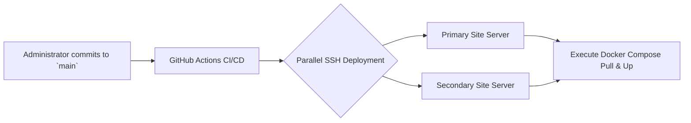
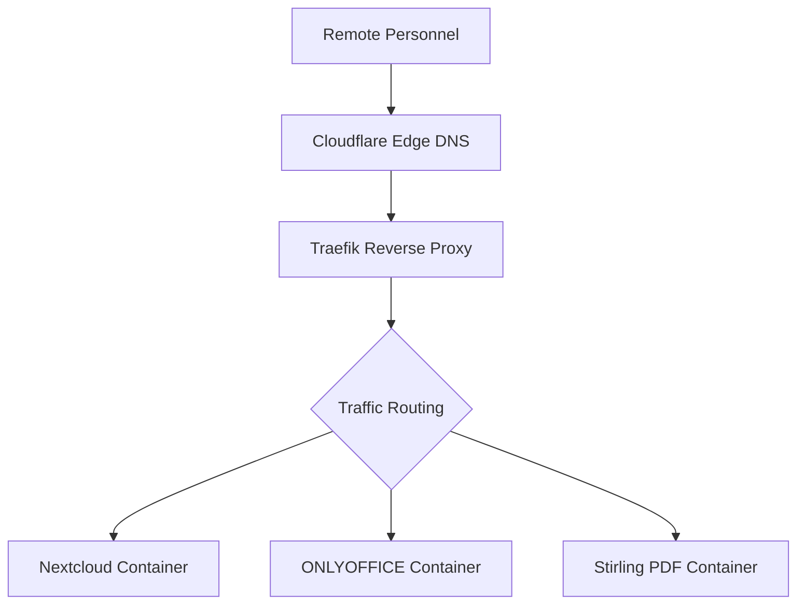
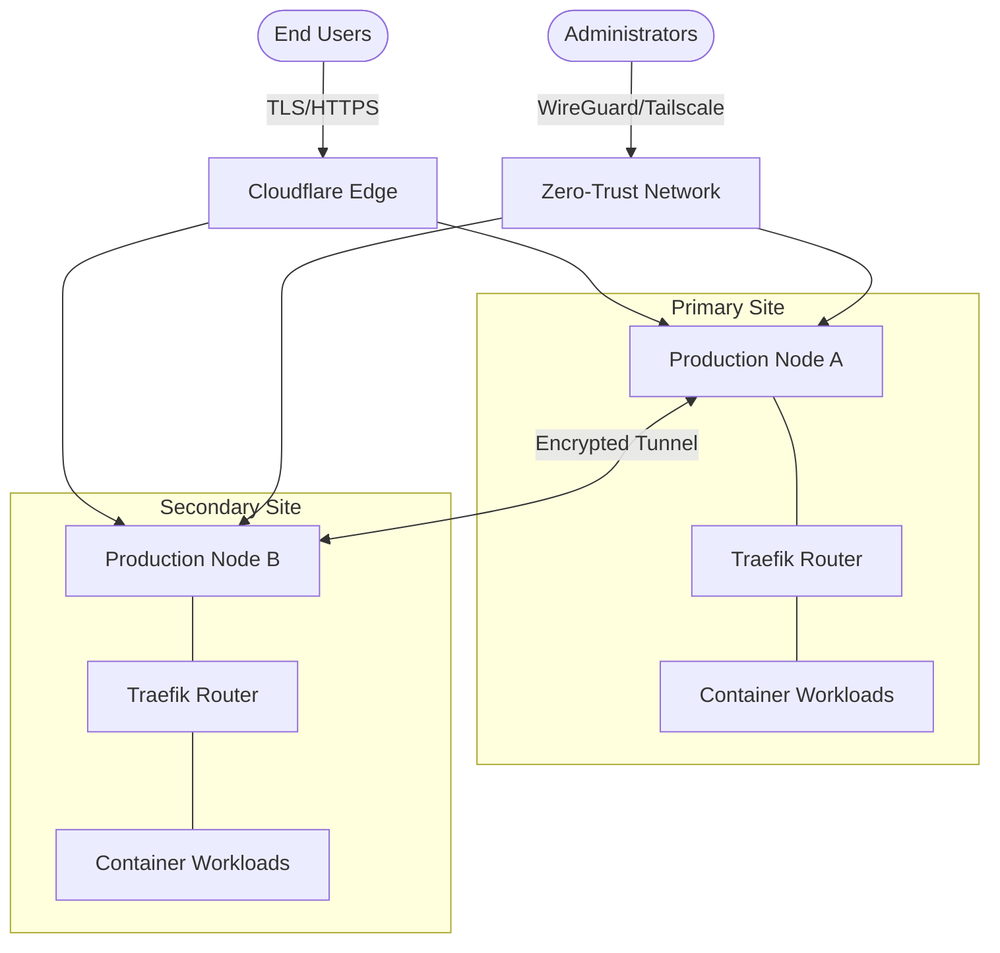

# Private Company Cloud Infrastructure

[](https://ubuntu.com/)


**A highly available, self-hosted enterprise private cloud infrastructure designed for secure file synchronization, collaborative document editing, and centralized internal tooling.**

> **Target Audience**
> This infrastructure is engineered for private company personnel requiring secure, real-time collaboration platforms, and systems administrators overseeing multi-site deployments with stringent security and uptime requirements.

> **Business Value**
> Replaces fragmented, high-cost public SaaS subscriptions with a unified, self-hosted private cloud. It ensures complete data sovereignty, offers enterprise-grade capabilities, and drastically reduces operational expenditures across multiple organizational locations.

> **Technical Highlights**
> - Redundant, high-availability architecture across distributed edge locations
> - Zero-trust network access (ZTNA) and secure administration via Tailscale VPN
> - Infrastructure-as-Code (IaC) provisioning via Ansible
> - Fully automated CI/CD deployment pipelines via GitHub Actions
> - Automated SSL certificate lifecycle management and reverse proxying with Traefik v3
> - Self-hosted file storage (Nextcloud) integrated with real-time document editing (ONLYOFFICE)

---

## Pre-requisites & Account Setup

Prior to deployment, ensure organizational accounts and API credentials are provisioned for the following services:

| Service | Purpose & Explanation | Platform |
|---------|---------|------|
| **Cloudflare** | **DNS & Edge Protection:** Acts as the entry point for all traffic, hiding our real server IP addresses from the public web and mitigating malicious traffic or DDoS attacks before they reach our servers. | [cloudflare.com](https://www.cloudflare.com/) |
| **Tailscale** | **Zero-Trust Network:** Creates a secure, encrypted peer-to-peer network (VPN) that allows administrators to securely SSH into servers and access backend dashboards without opening dangerous ports to the public internet. | [tailscale.com](https://tailscale.com/) |
| **GitHub** | **CI/CD & Version Control:** Hosts our infrastructure code. GitHub Actions automatically pushes updates to our servers when code changes, and GitHub Secrets securely stores our passwords and API keys. | [github.com](https://github.com/) |
| **Backblaze B2** | **Offsite Backups:** Provides enterprise-grade, encrypted cloud storage where our daily automated system and database backups are securely stored offsite for disaster recovery. | [backblaze.com](https://www.backblaze.com/) |

---

## Infrastructure Overview

This Private Company Cloud serves as an integrated, self-hosted ecosystem. It provides personnel with secure data storage and real-time collaboration tools, while equipping administrators with a centralized dashboard for deployment, monitoring, and automated disaster recovery.

**For Organizational Personnel:** Access organizational assets securely from any location via `files.company.com`. Collaborate on standard document formats (Word, Excel, PowerPoint) directly within the browser, and leverage internal utilities for document processing.

**For Systems Administrators:** Execute seamless, automated deployments across multiple server environments utilizing GitHub Actions. Monitor system telemetry in real-time, manage containerized workloads, and ensure business continuity through automated backup schedules.

### Primary Use Cases

- **Secure Remote Access:** Remote personnel securely accessing and synchronizing internal files.
- **Real-Time Collaboration:** Cross-functional teams co-authoring corporate documents simultaneously.
- **Automated Lifecycle Management:** Administrators pushing infrastructure updates globally via version control.
- **Data Sovereignty:** Executive management ensuring all proprietary data remains isolated, private, and securely backed up offsite.

### Core Architecture Components

- Nextcloud + ONLYOFFICE Integrated Suite
- Ubuntu 24.04 LTS operating in a Docker containerized environment
- Traefik Reverse Proxy enforcing Let's Encrypt TLS
- Automated offsite backup lifecycle via Duplicati and Backblaze B2
- Infrastructure defined as Code (Ansible & GitHub Actions)
- Localized DNS-level threat and tracker mitigation (AdGuard)

## Features & Explanations

### End-User Services (Internal)

| Capability | Access Point | Detailed Explanation |
|---------|-------------|-------------|
| **File Storage & Synchronization** | `files.company.com` | **Powered by Nextcloud:** A self-hosted alternative to Google Drive or Dropbox. It provides secure enterprise file sharing, cross-device synchronization, and granular folder permissions for different teams. |
| **Collaborative Editing** | `office.company.com` | **Powered by ONLYOFFICE:** A robust office suite running entirely in the browser. It integrates directly with Nextcloud to allow multiple employees to co-author Word documents, Excel spreadsheets, and PowerPoint presentations in real-time. |
| **Document Processing** | `pdf.company.com` | **Powered by Stirling PDF:** A private suite of PDF tools. It allows employees to modify, merge, sign, and convert PDFs securely without uploading confidential company data to third-party public websites. |
| **Network Protection** | `dns.company.com` | **Powered by AdGuard:** A localized DNS resolver that filters out malware domains, tracking scripts, and intrusive advertisements, protecting employees while connected to the company network. |

### Administrative Tooling

| Capability | Access Point | Detailed Explanation |
|---------|-------------|-------------|
| **Workload Management** | `portainer.company.com` | **Powered by Portainer:** Provides administrators with a visual interface to manage Docker containers, view application logs in real-time, restart crashed services, and monitor container resource usage without needing terminal access. |
| **System Telemetry** | `monitor.company.com` | **Powered by Netdata:** A high-fidelity performance monitoring system that streams real-time metrics (CPU usage, RAM, disk I/O, network bandwidth) to help administrators identify bottlenecks and troubleshoot performance issues instantly. |
| **Disaster Recovery** | `backup.company.com` | **Powered by Duplicati:** Handles automated, encrypted, and compressed daily backups of our databases and application state, pushing them to Backblaze B2 to ensure business continuity in case of hardware failure. |
| **Traffic Orchestration** | `traefik.company.com` | **Powered by Traefik v3:** Our reverse proxy and API gateway. It intelligently routes incoming web traffic to the correct containerized application and automatically negotiates and renews Let's Encrypt SSL certificates for HTTPS security. |

### Advanced Technical Capabilities

| Feature | Strategic Advantage & Explanation |
|---------|----------------|
| **Continuous Deployment** | Automated GitHub Action pipelines trigger server-wide updates upon commits to the `main` branch, ensuring all servers are instantly synced with our latest configuration. |
| **Zero-Trust Access** | Administrative interfaces and SSH access are strictly confined to the Tailscale secure overlay network. This means our servers have no open administrative ports exposed to the public internet, preventing brute-force attacks. |
| **Automated Provisioning** | Spin up bare-metal servers into production-ready nodes utilizing parameterized Ansible playbooks. Ansible configures the OS, installs dependencies, and locks down security automatically, removing human error. |
| **Automated Patching** | Watchtower runs in the background to automatically update non-critical Docker containers to their latest stable versions. Critical data persistence layers (Nextcloud/ONLYOFFICE) are excluded for controlled manual updates. |
| **Edge Protection** | Cloudflare proxies our web traffic to obscure origin IPs from attackers and mitigates volumetric DDoS attacks at the edge, before they ever reach our infrastructure. |
| **Secrets Management** | Cryptographic keys and `.env` variables are securely injected via GitHub Secrets at deployment time, preventing sensitive credentials from ever being exposed in the repository code. |
| **Hardened Posture** | The servers are locked down with Uncomplicated Firewall (UFW), Fail2ban intrusion prevention (blocking IPs after failed logins), key-only SSH authentication (no passwords allowed), and disabled root logins. |

---

## System Workflows

### Deployment Pipeline Architecture



### End-User Request Routing



### Global Network Architecture



---

## Initial Provisioning Guide

For comprehensive documentation, please reference the `ansible/README.md` procedural guide.

**Execution Summary:**
```bash
# 1. Execute Ansible playbooks against a pristine Ubuntu environment
ansible-playbook -i ansible/inventory.ini ansible/playbook.yml

# 2. Populate environment variables on the target nodes
cp .env.example .env && nano .env

# 3. Initialize the reverse proxy to establish TLS certificates
cd services/traefik && docker compose up -d

# 4. Initialize application workloads
cd services/nextcloud && docker compose up -d
cd services/onlyoffice && docker compose up -d
# ... initialize remaining service directories

# 5. Authenticate the node to the Tailscale overlay network
tailscale up --authkey=YOUR_AUTH_KEY
```

> **Maintenance Advisory:** Core storage and editing services (Nextcloud and ONLYOFFICE) are intentionally excluded from automated patching routines to ensure data integrity. Updates for these modules must be executed manually following a verified system backup. Please consult internal documentation for specific upgrade methodologies.


