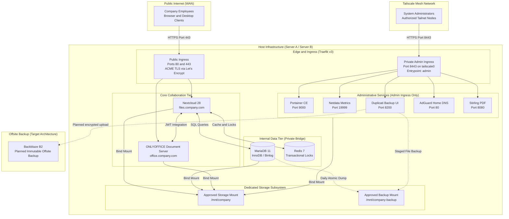

# Private Company Cloud Infrastructure

A self-hosted enterprise file-collaboration and private-cloud platform built on Nextcloud, ONLYOFFICE, containerized infrastructure services, encrypted administrative ingress, fail-closed storage safety, and automated deployment pipelines.

---

## Overview

The Private Company Cloud provides an organization with a self-contained, sovereign alternative to public cloud storage and document collaboration suites. Designed for operational security and data control, it combines browser-based office editing and file synchronization with strict host-level guardrails against silent storage corruption, unmanaged container autostart, and public administrative exposure.

The platform operates as a single-primary-node deployment per site with canary deployment staging, prioritizing consistency and simplicity over fragile clustering topologies.

---

## Core Capabilities

- **Private Enterprise File Cloud:** Centralized file synchronization, sharing, and versioning powered by [Nextcloud](https://nextcloud.com) 28.
- **Browser-Based Office Collaboration:** Real-time concurrent document, spreadsheet, and presentation editing via [ONLYOFFICE](https://www.onlyoffice.com) Document Server with JWT authentication.
- **Automated TLS & Reverse Proxy:** Edge routing, automatic [Let's Encrypt](https://letsencrypt.org) certificate lifecycle management, and HSTS enforcement via [Traefik Proxy](https://traefik.io/traefik) v3.
- **Private Administrative Plane:** Host and service administration (Portainer, Netdata, Duplicati, AdGuard, Stirling PDF) isolated behind private [Tailscale](https://tailscale.com) Tailnet endpoints.
- **Fail-Closed Storage Safety:** Kernel-level mount verification (`findmnt -M`) ensuring that containers never write to host root filesystems during storage disconnects.
- **Managed Startup Lifecycle:** Systemd-governed container startup with enforced preflight gates; unmanaged `docker compose up` commands fail closed.
- **Atomic Database Backup:** Application-consistent, transaction-locked [MariaDB](https://mariadb.org) logical dumps with gzip verification, relative SHA-256 manifests, and atomic rename.
- **Canary Deployment Automation:** [GitHub Actions](https://docs.github.com/en/actions) CI/CD with isolated worktree preflights, immutable commit pinning, and serial node rollout.

---

## Architecture



---

## Services

| Service | Purpose | Exposure | Ingress Route / Endpoint |
|---|---|---|---|
| **[Nextcloud](https://nextcloud.com)** | Enterprise file sync, share, and collaboration | Public HTTPS | `https://files.company.com` |
| **[ONLYOFFICE](https://www.onlyoffice.com/docs)** | Browser document editor (DOCX, XLSX, PPTX) | Public HTTPS | `https://office.company.com` |
| **[Traefik Proxy](https://traefik.io/traefik)** | Reverse proxy, TLS edge termination, routing | Public / Private | Ports `80`, `443` (Public); Port `8443` (Tailnet) |
| **[MariaDB](https://mariadb.org)** | Nextcloud transactional database | Internal Only | Internal Docker network (`nextcloud-internal`) |
| **[Redis](https://redis.io)** | In-memory session cache and transactional locks | Internal Only | Internal Docker network (`nextcloud-internal`) |
| **[Portainer CE](https://www.portainer.io)** | Container infrastructure management | Tailnet Only | `https://portainer.company.com:8443` |
| **[Netdata](https://www.netdata.cloud)** | Real-time system performance and telemetry | Tailnet Only | `https://monitor.company.com:8443` |
| **[Duplicati](https://www.duplicati.com)** | Encrypted backup orchestration | Tailnet Only | `https://backup.company.com:8443` |
| **[AdGuard Home](https://adguard.com/en/adguard-home/overview.html)** | DNS filtering and internal resolver | Tailnet / LAN | UI on `:8443`; Port `53` restricted to approved LANs |
| **[Stirling PDF](https://github.com/Stirling-Tools/Stirling-PDF)** | Document utility and PDF conversion suite | Tailnet Only | `https://pdf.company.com:8443` (Security Enabled) |
| **[Watchtower](https://containrrr.dev/watchtower/)** | Automated image update monitor | Disabled | Profile `manual-updates`; monitor-only mode |

---

## Security Model

The security architecture enforces layered defense across network, host, and application boundaries:

- **Isolated Administrative Ingress:** Port 8443 binds exclusively to the host's active `tailscale0` IP address (`TAILSCALE_ADMIN_BIND_IP:8443`). No administrative web interfaces are exposed on `0.0.0.0` or public IPv6 addresses.
- **Fail-Closed Storage Gate:** Production containers will not start unless `scripts/verify-storage.sh` verifies dedicated filesystem mounts, non-root paths, and matching pool signatures via Linux `findmnt -M`.
- **Managed Container Lifecycle:** Stateful services enforce `profiles: ["managed"]` and `restart: "no"`. Containers cannot autostart on reboot or via direct Compose commands without passing preflight validation.
- **Host Firewall & SSH Hardening:** [UFW](https://launchpad.net/ufw) defaults to denying all incoming traffic, permitting only ports 80 and 443 globally. Public SSH access (port 22) is removed once private Tailscale access is confirmed, with root and password login disabled.
- **Secret Isolation:** Environment secrets reside exclusively on the server in `/opt/server/.env` (mode `0600`), which is untracked and excluded from version control. CI/CD pipelines inject only deployment trigger keys.

---

## Storage & Data Safety

The platform treats storage as an authoritative contract rather than simple directory paths.

- **Authoritative Configuration:** Mount requirements are governed by `/etc/company-storage.conf`, specifying approved mountpoints, filesystem types (e.g., [OpenZFS](https://openzfs.org)), and device sources.
- **Divergence Prevention:** Production preflight confirms that `.env` storage variables strictly equal `/etc/company-storage.conf` values before exporting them into the managed Compose runtime.
- **Migration Safeguard:** Startup is blocked if legacy Docker volumes or bind paths exist without a versioned, reviewed migration receipt (`.company-migration-complete`) and non-empty destination paths.

*For complete technical storage specifications and dataset layout maps, refer to [INFRASTRUCTURE.md: Storage Architecture and Data Integrity](INFRASTRUCTURE.md#6-storage-architecture-and-data-integrity).*

---

## Backup & Recovery

The backup subsystem combines automated local staging with planned immutable offsite retention:

- **Application-Consistent MariaDB Dumps:** Triggered daily via `company-mariadb-backup.timer`. Generates transactional dumps streamed to `.partial` files, verified for gzip integrity and SQL statement contents, stamped with SHA-256 manifests, and finalized via atomic file moves.
- **Staging Isolation:** Dumps are written to dedicated backup mounts (`/mnt/company-backup/mariadb`), isolated from live application datadirs.
- **Offsite 3-2-1-1-0 Strategy:** Architecture designed for Duplicati encryption to [Backblaze B2](https://www.backblaze.com/docs) with [B2 Object Lock](https://www.backblaze.com/docs/cloud-storage-object-lock) (immutability) and routine restoration testing.

*Note: Offsite cloud storage, immutable retention locking, and automated disaster-recovery drills require live infrastructure deployment. See [INFRASTRUCTURE.md: Backup Architecture](INFRASTRUCTURE.md#9-backup-architecture).*

---

## Deployment Architecture

The project decouples continuous integration (repository validation) from production host deployment to ensure repository integrity can be verified automatically without requiring access to physical hardware.

### Continuous Integration Pipeline
Continuous integration is automated via `.github/workflows/ci.yml` on every push to `main` and pull request:
- **Shell Syntax Validation:** Verifies syntax across all operational shell scripts (`bash -n scripts/*.sh`) and test harnesses.
- **Compose Definition Validation:** Verifies Compose files across local workstation definitions and production profiles (`--profile managed`).
- **Safety Regression Harness:** Executes the non-destructive Phase 0–1 safety regression test suite (`tests/phase_0_1_safety.sh`, 15/15 checks).

### Production Deployment Sequence
Production deployment is automated via `.github/workflows/deploy.yml` and is triggered on-demand via `workflow_dispatch` (manual trigger) once target hardware is provisioned:

```text
Manual Production Deployment (workflow_dispatch)
                     │
                     ▼
          Resolve target commit SHA
                     │
                     ▼
[Deploy → Server A (Primary Node)]
       ├─► Fetch origin/main & resolve immutable target commit SHA
       ├─► Create isolated temporary git worktree
       ├─► Execute production preflight validation (scripts/production-preflight.sh)
       ├─► Fast-forward live checkout (git merge --ff-only TARGET_SHA)
       ├─► Restart managed systemd service (company-applications.service)
       └─► Validate container health and TLS endpoints
       │
       │ (Rollout proceeds to Server B only if Server A health checks pass)
       ▼
[Deploy → Server B (Secondary Node)]
       └─► Executes identical preflight, update, and validation sequence
```

This workflow guarantees that the exact commit that passed preflight validation is the commit deployed to production, preventing race conditions or branch divergence.

---

## Deployment Prerequisites

Automated production deployment is intentionally inactive until physical server infrastructure is provisioned and authenticated.

### Required GitHub Actions Secrets
The deployment workflow (`.github/workflows/deploy.yml`) references the following repository secret names:

| Secret Name | Purpose |
|---|---|
| `SERVER_A_IP` | SSH address of primary deployment node |
| `SERVER_B_IP` | SSH address of secondary/canary deployment node |
| `SERVER_USER` | Restricted deployment user account on the target hosts |
| `SSH_PRIVATE_KEY` | Private SSH key matching the public key authorized on both servers |

*Security Policy: In accordance with enterprise security standards, secrets are stored exclusively in GitHub Actions and never committed to version control. No secret values or real/fake IP addresses are embedded in this repository.*

### Secret Configuration Location
To configure deployment secrets, navigate in GitHub to:
**Repository Settings → Secrets and variables → Actions → Repository secrets**

### Host Prerequisites for Live Deployment
Before a live deployment can execute successfully, the following infrastructure conditions must be established:
1. **Host Reachability:** Server A and Server B must be powered on, running Ubuntu 24.04 LTS, and reachable over SSH (port 22 or designated deployment port).
2. **Deployment Account:** The user specified in `SERVER_USER` must exist on both hosts with sudo permissions restricted to necessary deployment commands.
3. **SSH Authentication:** The public key corresponding to `SSH_PRIVATE_KEY` must be installed in `~/.ssh/authorized_keys` for the deployment user on both nodes.
4. **Network & Routing:** Firewall rules (UFW), cloud security groups, or Tailnet mesh routing must permit inbound SSH from the GitHub Actions runner IP range or designated proxy runner.
5. **Host Repository Path:** The repository must be cloned to `/opt/server` on both nodes with proper file ownership.
6. **Storage Gate Fulfillment:** Phase 0–1 storage prerequisites must be satisfied (`/etc/company-storage.conf` configured, physical storage mounted, layout initialized).

### Current CI/CD Behavior
- **Repository Validation:** **PASS** — Every push to `main` executes `.github/workflows/ci.yml`, verifying script syntax, compose manifests, and safety test suites. This runs cleanly without physical hardware.
- **Production Deployment:** **INACTIVE** — `.github/workflows/deploy.yml` is configured with `workflow_dispatch` (manual trigger). It does not automatically run on every push, preventing failed deployment runs while physical hardware is unprovisioned.

---

## Repository Structure

```text
├── .github/
│   └── workflows/
│       ├── ci.yml                     # Static syntax & safety regression CI workflow
│       └── deploy.yml                 # Manual serial canary deployment workflow
├── ansible/
│   ├── group_vars/
│   │   └── all.yml.example            # Storage and access configuration template
│   ├── templates/
│   │   ├── 99-company-ssh.conf.j2     # Hardened SSH configuration template
│   │   └── company-storage.conf.j2    # Authoritative storage contract template
│   ├── inventory.ini                  # Server deployment inventory
│   ├── playbook.yml                   # Host provisioning playbook
│   └── README.md                      # Ansible execution documentation
├── scripts/
│   ├── backup-mariadb.sh              # Atomic, validated MariaDB logical backup
│   ├── check-services.sh              # Service health and TLS expiration validation
│   ├── compose-managed.sh             # Managed Compose execution wrapper
│   ├── compose-stop.sh                # Graceful service termination wrapper
│   ├── disable-unmanaged-autostart.sh # Clears legacy Docker restart policies
│   ├── initialize-storage-layout.sh   # Provisions directory structure and sentinel
│   ├── production-preflight.sh        # Authoritative preflight validation gate
│   ├── record-migration-complete.sh   # Generates reviewed migration receipt
│   ├── verify-migration.sh            # Migration safeguard validation
│   └── verify-storage.sh              # Kernel mountpoint verification guard
├── services/                          # Production service Docker Compose definitions
│   ├── adguard/
│   ├── duplicati/
│   ├── netdata/
│   ├── nextcloud/
│   ├── onlyoffice/
│   ├── portainer/
│   ├── stirling-pdf/
│   ├── traefik/
│   └── watchtower/
├── systemd/
│   ├── company-applications.service   # Systemd stateful application lifecycle unit
│   ├── company-mariadb-backup.service # Automated backup execution service
│   ├── company-mariadb-backup.timer   # Daily backup calendar timer
│   └── company-storage-guard.service  # Oneshot boot storage verification unit
├── tests/
│   └── phase_0_1_safety.sh            # Non-destructive regression harness
├── .env.example                       # Production environment configuration template
├── docker-compose.local.yml           # Local development Compose definition
├── INFRASTRUCTURE.md                  # Comprehensive technical manual & runbook
└── README.md                          # Primary project landing page
```

---

## Requirements

### Software Prerequisites
- **Host OS:** [Ubuntu 24.04 LTS](https://releases.ubuntu.com/24.04/) (Noble Numbat)
- **Container Runtime:** [Docker Engine](https://docs.docker.com/engine/) 26+ with [Docker Compose](https://docs.docker.com/compose/) v2.20+
- **Network Client:** [Tailscale](https://tailscale.com/docs) client 1.60+
- **Management Tools:** [Ansible](https://docs.ansible.com) 9+ (for host provisioning), Bash 5+

### Production Hardware Baseline
- **Processor:** 8+ cores (x86_64, AMD EPYC or Intel Xeon)
- **Memory:** 32 GB RAM minimum (64 GB+ recommended; ECC RAM strongly advised)
- **Boot Drives:** 2× enterprise SSDs in RAID 1 mirror (isolated from data pools)
- **Storage Drives:** Enterprise CMR SATA/SAS drives in [OpenZFS](https://openzfs.org) Mirror or RAIDZ2 pool
- **Power Protection:** Smart UPS with network or USB management card for graceful automated shutdown

---

## Getting Started

### Local Development
To run the lightweight local development stack on a development workstation:
```bash
# 1. Copy local environment variables
cp .env.example .env

# 2. Start local development services
docker compose -f docker-compose.local.yml up -d
```
*Note: `docker-compose.local.yml` uses local named volumes and insecure endpoints for workstation testing only.*

### Production Setup Overview
Production deployment follows a strict sequence:
1. **Document Hardware:** Complete the Hardware Decision Record in [INFRASTRUCTURE.md: Hardware Requirements and Sizing](INFRASTRUCTURE.md#14-hardware-requirements-and-sizing).
2. **Provision Host:** Run the Ansible playbook (`ansible/playbook.yml`) with hardware storage facts configured in `ansible/group_vars/all.yml`.
3. **Mount Dedicated Storage:** Partition and mount production storage at `/mnt/company` and backup storage at `/mnt/company-backup`.
4. **Initialize Layout:** Execute `scripts/initialize-storage-layout.sh`.
5. **Migrate Existing Data:** If migrating from legacy volumes, complete data copy and execute `scripts/record-migration-complete.sh`.
6. **Mark Ready & Start:** Create the readiness sentinel (`initialize-storage-layout.sh --mark-ready`) and start applications via `systemctl start company-applications.service`.

*For detailed, step-by-step production runbooks, see [INFRASTRUCTURE.md: Administrator Runbook](INFRASTRUCTURE.md#15-administrator-runbook).*

---

## Current Readiness

| Dimension | Status | Notes |
|---|---|---|
| **Repository Validation** | **PASS — Ready for isolated live-host validation** | All Phase 0–1 safety controls, shell scripts, Compose configurations, backup atomicity, and regression tests are verified. Continuous integration validates every commit. |
| **Automated Production Deployment** | **INACTIVE — Physical deployment hosts are not currently provisioned** | Serial canary deployment workflow is preserved under manual trigger (`workflow_dispatch`); execution requires physical hardware and GitHub repository secrets. |
| **Production Infrastructure** | **NOT READY — Live infrastructure validation required** | Blocked pending live validation on physical hardware, real ZFS pool testing, reboot behavior, offsite B2 integration, and full restore drills. |

### Remaining Live-Host Validation Tasks
Prior to promoting any server to live production status:
1. **Hardware Storage Mounts:** Validate physical ZFS pool import and verify fail-closed unmount behavior.
2. **Host Reboot & Daemon Restart:** Verify that Docker daemon restarts do not autostart containers before systemd validation.
3. **Tailnet Network Isolation:** Perform external port scans to prove port 8443 is unreachable from the public internet.
4. **Historical Data Migration:** Execute end-to-end data transfer and verify database integrity and user logins.
5. **Offsite Backup & Restore Drill:** Execute full backup to Backblaze B2 with Object Lock and complete a clean-host restoration drill.

---

## Documentation

The project documentation is organized into two primary technical manuals:

- [README.md](README.md) — High-level architecture, executive summary, service inventory, and project landing page.
- [INFRASTRUCTURE.md](INFRASTRUCTURE.md) — Exhaustive technical manual, storage design, disaster-recovery protocols, runbooks, and live-host checklists.

---

## Roadmap

Planned future capabilities (post live-host validation):
- **Centralized Identity & SSO (Phase 2):** Integration with [Keycloak](https://www.keycloak.org) or enterprise IdPs via [SAML 2.0](https://docs.oasis-open.org/security/saml/v2.0/) / [OpenID Connect](https://openid.net/developers/how-connect-works/) with [WebAuthn](https://www.w3.org/TR/webauthn-2/) MFA.
- **Enterprise File Governance (Phase 2):** Automated Nextcloud retention rules, Group Folders, and antivirus scanning.
- **Warm Standby Disaster Recovery (Phase 3):** Automated ZFS snapshot replication ([zrepl](https://zrepl.github.io) / [syncoid](https://github.com/jimsalterjrs/sanoid)) to a secondary warm site.
- **Centralized Telemetry (Phase 4):** Central log aggregation and alerting via [Prometheus](https://prometheus.io), [Grafana](https://grafana.com), and [Loki](https://grafana.com/oss/loki/).

---

## License

Confidential — Internal Company Use Only. All rights reserved.
